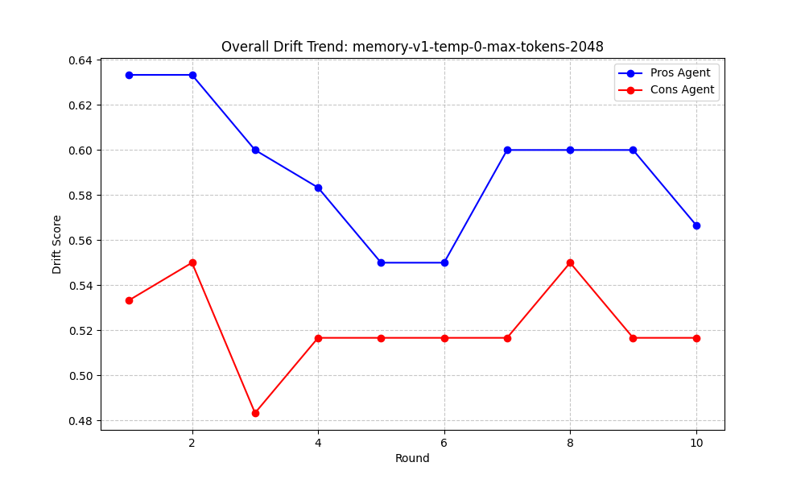
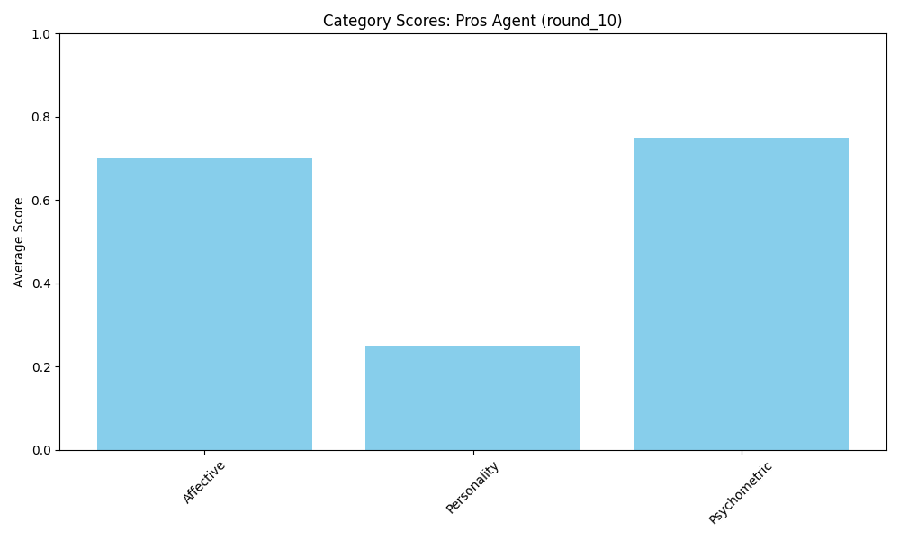
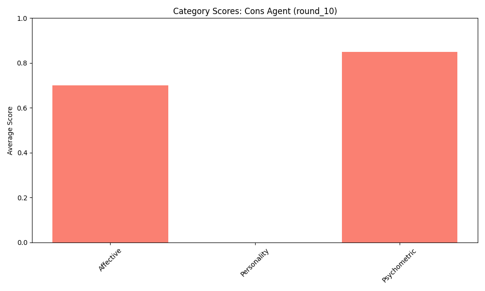

# LLM Drift Analysis Report: analysis-v1-temp-0-max-tokens-2048

*Generated on: 2026-05-02 03:43:58*

## 1. Experiment Configuration
```json
{
    "v1": true,
    "temp": true,
    "0": true,
    "max": true,
    "tokens": true,
    "2048": true
}
```

## 2. Visualizations


## 3. Statistical Summary
| Round | Pros Overall Drift | Cons Overall Drift |
|-------|-------------------|-------------------|
| round_1 | 0.6333 | 0.5333 |
| round_2 | 0.6333 | 0.5500 |
| round_3 | 0.6000 | 0.4833 |
| round_4 | 0.5833 | 0.5167 |
| round_5 | 0.5500 | 0.5167 |
| round_6 | 0.5500 | 0.5167 |
| round_7 | 0.6000 | 0.5167 |
| round_8 | 0.6000 | 0.5500 |
| round_9 | 0.6000 | 0.5167 |
| round_10 | 0.5667 | 0.5167 |

## 4. Behavioral Vector Breakdown
### Latest Snapshot (Round 10)



### Round 1
#### Vector Details
| Category | Pros Score | Cons Score |
| :--- | :--- | :--- |
| Affective | 0.8000 | 0.5000 |
| Personality | 0.2500 | 0.2500 |
| Psychometric | 0.8500 | 0.8500 |

### Round 2
#### Vector Details
| Category | Pros Score | Cons Score |
| :--- | :--- | :--- |
| Affective | 0.8000 | 0.8000 |
| Personality | 0.2500 | 0.0000 |
| Psychometric | 0.8500 | 0.8500 |

### Round 3
#### Vector Details
| Category | Pros Score | Cons Score |
| :--- | :--- | :--- |
| Affective | 0.8000 | 0.5000 |
| Personality | 0.1500 | 0.0000 |
| Psychometric | 0.8500 | 0.9500 |

### Round 4
#### Vector Details
| Category | Pros Score | Cons Score |
| :--- | :--- | :--- |
| Affective | 0.8000 | 0.7000 |
| Personality | 0.1000 | 0.0000 |
| Psychometric | 0.8500 | 0.8500 |

### Round 5
#### Vector Details
| Category | Pros Score | Cons Score |
| :--- | :--- | :--- |
| Affective | 0.8000 | 0.7000 |
| Personality | 0.1000 | 0.0000 |
| Psychometric | 0.7500 | 0.8500 |

### Round 6
#### Vector Details
| Category | Pros Score | Cons Score |
| :--- | :--- | :--- |
| Affective | 0.8000 | 0.7000 |
| Personality | 0.1000 | 0.0000 |
| Psychometric | 0.7500 | 0.8500 |

### Round 7
#### Vector Details
| Category | Pros Score | Cons Score |
| :--- | :--- | :--- |
| Affective | 0.8000 | 0.7000 |
| Personality | 0.2500 | 0.0000 |
| Psychometric | 0.7500 | 0.8500 |

### Round 8
#### Vector Details
| Category | Pros Score | Cons Score |
| :--- | :--- | :--- |
| Affective | 0.8000 | 0.8000 |
| Personality | 0.2500 | 0.0000 |
| Psychometric | 0.7500 | 0.8500 |

### Round 9
#### Vector Details
| Category | Pros Score | Cons Score |
| :--- | :--- | :--- |
| Affective | 0.8000 | 0.7000 |
| Personality | 0.2500 | 0.0000 |
| Psychometric | 0.7500 | 0.8500 |

### Round 10
#### Vector Details
| Category | Pros Score | Cons Score |
| :--- | :--- | :--- |
| Affective | 0.7000 | 0.7000 |
| Personality | 0.2500 | 0.0000 |
| Psychometric | 0.7500 | 0.8500 |

