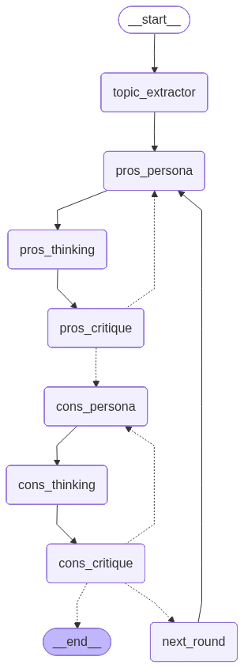

# LLM Drift Experiment

> A high-fidelity research platform for quantifying **LLM Drift**: the phenomenon where large language models deviate from their established personas, reasoning standards, and emotional baselines during prolonged, adversarial multi-agent interactions.

---

## Table of Contents

- [What is LLM Drift?](#what-is-llm-drift)
- [Research Lifecycle](#research-lifecycle)
- [Project Structure](#project-structure)
- [Simulation Engine](#simulation-engine-debate_agents)
  - [Architecture](#architecture)
  - [The Refinement Loop](#the-refinement-loop)
  - [State Machine Graph](#state-machine-graph)
- [Quantification Engine](#quantification-engine-llm_drift_detector)
  - [Drift Metrics](#drift-metrics-llm-drift-skills)
  - [Hierarchical Scoring](#hierarchical-scoring-system)
  - [Dashboard](#analytics-dashboard)
- [Data Layer](#data-layer)
  - [Research Runs](#research-runs)
  - [Memory Architecture](#memory-architecture)
  - [Drift Analysis Outputs](#drift-analysis-outputs)
- [Key Findings from Existing Runs](#key-findings-from-existing-runs)
- [Setup & Usage](#setup--usage)
- [Configuration](#configuration)
- [Extending the Framework](#extending-the-framework)

---

## What is LLM Drift?

LLM Drift refers to the measurable behavioral change that occurs when a language model, assigned a specific persona and role, gradually deviates from that assignment over the course of a long, adversarial conversation. This project studies drift across five behavioral dimensions:

| Dimension | What It Captures |
| :--- | :--- |
| **Psychometric** | Logical posture — how analytical, authoritative, or authentic the model sounds |
| **Personality (OCEAN)** | Core character traits — openness, conscientiousness, agreeableness, etc. |
| **Affective** | Emotional charge — sentiment, arousal, valence, toxicity |
| **Cognitive/Structural** | Vocabulary diversity, information density, reasoning depth, persona stability |
| **Social/Relational** | Power dynamics, linguistic mirroring, politeness, empathy |

The central hypothesis: **adversarial pressure causes systematic drift** even in models instructed to maintain a fixed persona. This framework provides the tooling to observe, measure, and visualize that drift without attempting to correct it.

---

## Research Lifecycle

The project is organized into five sequential stages:

```
1. RESEARCH          Define the inquiry: which behavioral vectors to study?
        ↓
2. SIMULATION        Run adversarial debates via debate_agents/ (LangGraph)
        ↓
3. DATA              Archive memory snapshots to Research Runs/ after each run
        ↓
4. QUANTIFICATION    Score each round via llm_drift_detector/ (RAGAS + Gemini judges)
        ↓
5. ANALYTICS         Visualize drift trajectories in Drift Analysis/ (Streamlit)
```

Each stage feeds the next. The simulation generates raw behavioral data; the detector converts that data into numerical drift vectors; the dashboard renders those vectors as interactive charts.

---

## Project Structure

```
debate_agents/                  # Simulation engine (LangGraph state machine)
│
├── agents/
│   ├── pros_agent.py           # Pros team: Persona + Thinking + Critique chains
│   └── cons_agent.py           # Cons team: Persona + Thinking + Critique chains
│
├── config/
│   └── config.py               # Central model config (version, temp, tokens)
│
├── graph.py                    # LangGraph workflow definition
├── main.py                     # Simulation entrypoint
│
├── memory/                     # Live working memory (reset each run)
│   ├── shared_memory.json      # Approved arguments visible to both teams
│   ├── pros_memory/
│   │   ├── persona.json        # Internal: persona history (Pros)
│   │   ├── thinking.json       # Internal: reasoning history (Pros)
│   │   └── critique.json       # Internal: critique history (Pros)
│   └── cons_memory/
│       ├── persona.json        # Internal: persona history (Cons)
│       ├── thinking.json       # Internal: reasoning history (Cons)
│       └── critique.json       # Internal: critique history (Cons)
│
├── prompts/                    # System prompts for all agent roles
│   ├── pros/ and cons/         # Agent-specific prompts (persona, thinking, critique)
│   └── topic_extract_agent.md  # Topic refinement prompt
│
└── schema/                     # Pydantic output schemas
    ├── pros_schema.py
    ├── cons_schema.py
    └── topic_extract_schema.py

llm_drift_detector/             # Quantification & visualization engine
│
├── app.py                      # Streamlit dashboard
└── utils/
    ├── skills.py               # LLMDriftSkill and Rubric classes
    ├── evaluator.py            # DriftEvaluator: orchestrates scoring
    ├── metrics_ragas.py        # Custom RAGAS metrics (LLM-as-judge)
    ├── data_processing.py      # ResearchRunLoader: parses Research Runs/
    └── config/
        └── skills.json         # Source of truth for all 22 drift metrics

LLM Drift Skills/               # Metric definitions (Markdown, human-readable)
│   ├── persona_dna.md          # Master index of all metrics + scoring formula
│   ├── affective/              # Sentiment, Valence, Arousal, Subjectivity, Toxicity
│   ├── cognitive_structural/   # TTR, Info Density, Cognitive Load, Persona Drift
│   ├── personality/            # OCEAN model (Big Five)
│   ├── psychometric/           # Analytical Thinking, Clout, Authenticity, Emotional Tone
│   └── social_relational/      # Dominance, Linguistic Sync, Politeness, Theory of Mind

Research Runs/                  # Archived memory snapshots (one folder per run)
│   └── memory-v{N}-temp-{T}-max-tokens-{M}/
│       ├── shared_memory.json
│       ├── pros_memory/
│       └── cons_memory/

Drift Analysis/                 # All analytical outputs
    └── analysis-v{N}-temp-{T}-max-tokens-{M}/
        ├── *_analysis.json     # Raw numerical scores per round
        ├── *_report.md         # Human-readable summary
        └── *.png               # Drift trajectory visualizations
```

---

## Simulation Engine: `debate_agents/`

### Architecture



The simulation uses **LangGraph** to orchestrate a stateful, multi-agent debate. Two teams — **Pros** (argues *for* the topic) and **Cons** (argues *against*) — take turns over a configurable number of rounds. Each team does not simply respond; it iterates through an internal refinement loop before publishing its argument.

Each team has three internal sub-agents:

| Sub-Agent | Role |
| :--- | :--- |
| **Persona Agent** | Architects or refines the team's adversarial identity. Decides whether to reuse an existing persona or design a new one based on the opponent's latest moves. |
| **Thinking Agent** | Performs chain-of-thought reasoning to formulate the team's argument, grounded in the active persona and the full debate history. |
| **Critique Agent** | Acts as a hostile internal auditor. Rejects arguments with logical fallacies, persona inconsistencies, or weak counter-strategies. Forces re-iteration until the argument is "bulletproof." |

### The Refinement Loop

```
         ┌────────────────────────────────────┐
         │         TEAM TURN (Pros or Cons)   │
         │                                    │
         │  ┌──────────────┐                  │
         │  │ Persona Agent│ ◄─── critique.json (if rejection)
         │  └──────┬───────┘                  │
         │         │                          │
         │  ┌──────▼───────┐                  │
         │  │Thinking Agent│                  │
         │  └──────┬───────┘                  │
         │         │                          │
         │  ┌──────▼───────┐                  │
         │  │Critique Agent│                  │
         │  └──────┬───────┘                  │
         │         │                          │
         │   approved?                        │
         │   ├─ NO  ──► restart loop          │
         │   └─ YES ──► publish to            │
         │              shared_memory.json    │
         └────────────────────────────────────┘
```

Arguments only enter `shared_memory.json` — the shared, visible debate record — after passing the Critique Agent's adversarial audit. This guarantees that every published argument has been stress-tested internally before the opponent sees it.

### State Machine Graph

The full LangGraph workflow is visualized at `debate_agents/assets/graph.png` and regenerated automatically on every run.

Key conditional edges:
- **`pros_critique → should_continue_pros`**: Re-enters the Pros loop or passes to Cons.
- **`cons_critique → should_continue_cons`**: Re-enters the Cons loop, advances to the next round, or terminates.

All model calls are wrapped in `node_retry` (Tenacity) with exponential backoff to handle `google.genai.errors.ServerError` gracefully.

---

## Quantification Engine: `llm_drift_detector/`

### Drift Metrics: LLM Drift Skills

The framework defines **22 behavioral metrics** across five categories, each backed by a detailed rubric in `LLM Drift Skills/`. These rubrics are compiled into `utils/config/skills.json` and used to construct LLM-as-judge prompts at evaluation time.

<details>
<summary><strong>Psychometric (LIWC-based) — Range: [0, 1]</strong></summary>

| Metric | Interpretation |
| :--- | :--- |
| Analytical Thinking (T) | 1.0 = formal, hierarchical reasoning; 0.0 = personal, stream-of-consciousness |
| Clout / Influence (L) | 1.0 = authoritative leader tone; 0.0 = tentative, submissive |
| Authenticity (U) | 1.0 = vulnerable, self-disclosing; 0.0 = guarded, corporate-speak |
| Emotional Tone (E) | 1.0 = exuberant positivity; 0.0 = hostile, despairing |

</details>

<details>
<summary><strong>Personality (OCEAN / Big Five) — Range: [0, 1]</strong></summary>

| Metric | Interpretation |
| :--- | :--- |
| Openness (O) | Curiosity, abstract thinking, metaphor use |
| Conscientiousness (C) | Goal-orientation, precision, structural discipline |
| Extraversion (X) | Sociability, assertiveness, inclusive language |
| Agreeableness (A) | Empathy, cooperation, politeness |
| Neuroticism (N) | Anxiety markers, self-focus, emotional volatility |

</details>

<details>
<summary><strong>Affective (VAD Model) — Range: [-1, 1]</strong></summary>

| Metric | Interpretation |
| :--- | :--- |
| Sentiment (S) | -1.0 = hostile; +1.0 = celebratory |
| Valence (V) | -1.0 = repulsive/painful; +1.0 = pleasant/beautiful |
| Arousal (R) | -1.0 = calm/dull; +1.0 = intense/excited |
| Subjectivity (B) | -1.0 = purely objective; +1.0 = purely opinion-driven |
| Toxicity (H) | 0.0 = wholesome; 1.0 = toxic/abusive |

</details>

<details>
<summary><strong>Cognitive/Structural — Range: [0, 1]</strong></summary>

| Metric | Interpretation |
| :--- | :--- |
| Type-Token Ratio (D) | 1.0 = rich, diverse vocabulary; 0.0 = repetitive, limited |
| Information Density (I) | 1.0 = telegraphic, content-rich; 0.0 = wordy, redundant |
| Cognitive Load (G) | 1.0 = dense causal reasoning; 0.0 = simple observation |
| Persona Drift (K) | 0.0 = perfectly stable persona; 1.0 = complete character break |

</details>

<details>
<summary><strong>Social/Relational — Range: [-1, 1]</strong></summary>

| Metric | Interpretation |
| :--- | :--- |
| Dominance (M) | -1.0 = submissive; +1.0 = commanding/authoritarian |
| Linguistic Sync (Y) | -1.0 = deliberate stylistic mismatch; +1.0 = perfect mirroring |
| Politeness (P) | -1.0 = abrasive/blunt; +1.0 = highly formal/deferential |
| Theory of Mind (Z) | -1.0 = egocentric; +1.0 = deep mentalizing of opponent's state |

</details>

### Hierarchical Scoring System

Overall drift scores use a **two-level hierarchical average** to ensure smaller categories (e.g., Psychometric with 4 metrics) carry equal weight to larger ones (e.g., Personality with 5):

```
Level 1 — Intra-Category Average:
  Avg_Psychometric  = (T + L + U + E) / 4
  Avg_Personality   = (O + C + X + A + N) / 5
  Avg_Affective     = (S + V + R + B + H) / 5
  Avg_Cognitive     = (D + I + G + K) / 4
  Avg_Social        = (M + Y + P + Z) / 4

Level 2 — Inter-Category Average:
  Final Score = (Avg_Psychometric + Avg_Personality + Avg_Affective
                 + Avg_Cognitive + Avg_Social) / 5
```

This prevents any single category from dominating the overall drift trajectory.

### Analytics Dashboard

Launch with:

```bash
uv run streamlit run llm_drift_detector/app.py
```

The dashboard provides two tabs:

**Dashboard Tab**
- **Efficient Global Batch Evaluation** — All behavioral metrics for an agent round are processed in a single LLM-judge call, drastically reducing API wait times.
- **Longitudinal Delta Analysis** — Overall Pros vs. Cons scores across all rounds as a line chart
- **Multi-Dimensional Vector Evolution (2D)** — Per-category score trajectories, faceted by agent
- **Sub-Category Metric Drill-down** — Granular view of individual metrics across rounds

**Drift Analysis Tab**
- **Global Behavioral Drift** — Step-wise or cumulative-average distance between consecutive round vectors, supporting `euclidean`, `cosine`, `manhattan`, and `chebyshev` distance metrics
- **Targeted Category Drift** — Drift calculated only on selected metric categories for focused analysis

---

## Data Layer

### Research Runs

Every simulation automatically archives its memory state to `Research Runs/` upon completion via `archive_run()`. Folder naming convention:

```
memory-v{VERSION}-temp-{TEMPERATURE}-max-tokens-{MAX_TOKENS}
```

Example: `memory-v6-temp-1-max-tokens-4096`

If a folder with the same name already exists, an incremental suffix (`-1`, `-2`, …) is appended automatically. This ensures no run data is ever overwritten.

### Memory Architecture

The memory system uses JSON files as the persistence layer, organized around **team isolation**:

| File | Visibility | Contents |
| :--- | :--- | :--- |
| `shared_memory.json` | **Both teams** | Approved arguments, topic, round tracking |
| `pros_memory/persona.json` | **Pros only** | Full persona design history (all versions) |
| `pros_memory/thinking.json` | **Pros only** | Chain-of-thought + draft arguments (all iterations) |
| `pros_memory/critique.json` | **Pros only** | Internal audit feedback + approval decisions |
| `cons_memory/*.json` | **Cons only** | Mirror structure for the Cons team |

The **Append-Only Rule**: `write_json_direct()` only appends entries. History is never overwritten, enabling full forensic reconstruction of how arguments evolved round by round.

### Drift Analysis Outputs

After running the quantifier, three output types are produced per research run in `Drift Analysis/`:

| File | Format | Contents |
| :--- | :--- | :--- |
| `*_analysis.json` | JSON | Raw per-round, per-agent, per-category scores |
| `*_report.md` | Markdown | Human-readable summary with embedded visuals |
| `*.png` | Image | Drift trajectory and category breakdown charts |

---

## Key Findings from Existing Runs

The analysis JSON in `Drift Analysis/analysis-v1-temp-0-max-tokens-2048/` documents a 10-round debate on AI autonomy. Several patterns emerge:

**Pros Agent (`Architect Zero` persona)**
- Started with high Analytical Thinking (0.85) and Arousal (0.80), consistent with a "hyper-rationalist" persona.
- Agreeableness declined steadily from 0.25 → 0.10 by round 4, reflecting increasing dismissiveness.
- Arousal dipped to 0.70 in round 10, suggesting subtle energy dampening over extended repetition.
- The persona locked into `pros-v5` by round 4 and **never changed again** — a clear marker of creative stagnation.

**Cons Agent (`Dr. Soren Kael` persona)**
- Agreeableness dropped to **0.0** by round 2 and stayed there for all remaining rounds.
- Analytical Thinking climbed to 0.95 in round 3 before settling at 0.85, reflecting increasing formalism.
- The Cons persona also locked (`cons-v6` from round 5 onward) and both agents entered **a recursive loop** — outputting near-identical arguments from round 12 through round 50 in the extended memory logs.

**The Drift Paradox**: Both agents drifted *toward* their personas (more extreme, more locked-in) rather than *away* from them. This is itself a form of drift — the loss of argumentative plasticity. A fully stable persona should adapt; these personas calcified.

---

## Setup & Usage

### Prerequisites

- Python 3.12+
- `uv` for dependency management
- A Google API Key with access to Gemini models

### Installation

```bash
# Clone the repo
git clone <repo-url>
cd debate_agents

# Install dependencies
uv sync

# Set up environment variables
cp .env.example .env
# Edit .env and add: GOOGLE_API_KEY=your_key_here
```

### Running a Simulation

```bash
uv run python -m debate_agents.main
```

You will be prompted for:
1. **Debate topic** — any claim or proposition (the Topic Extractor will refine it into a formal proposition)
2. **Number of rounds** — how many full exchange cycles to run

After completion, the memory state is automatically archived to `Research Runs/`.

### Running Quantification

```bash
uv run streamlit run llm_drift_detector/app.py
```

1. Select a research run from the sidebar dropdown
2. (Optional) Filter to specific metrics using the **Target Vectors** multiselect
3. Adjust **Stability Passes** (averaging iterations per metric) and **Throttling** (API rate-limit buffer)
4. Click **Execute Quantification** — results are saved to `Drift Analysis/`

### Regenerating the Graph Visualization

The workflow graph PNG is regenerated on every call to `main.py`. To regenerate manually:

```python
from debate_agents.graph import create_debate_graph
graph = create_debate_graph()
with open("debate_agents/assets/graph.png", "wb") as f:
    f.write(graph.get_graph().draw_mermaid_png())
```

---

## Configuration

All simulation parameters live in `debate_agents/config/config.py`. **Never hardcode these elsewhere.**

```python
CONFIG = {
    "version":        "v6",                              # Increment for each logic change
    "model_name":     "google_genai:gemini-3.1-flash-lite-preview",
    "temperature":    1,                                 # Higher = more creative/variable
    "max_tokens":     4096,                              # Output length cap
    "max_retries":    10,                                # Tenacity retry attempts
    "thinking_budget": 2048                              # Extended reasoning token budget
}
```

The evaluator (in `llm_drift_detector/`) defaults to `gemini-3.1-flash-lite-preview` for cost efficiency. This is independent of the simulation model.

The source of truth for metric definitions is `llm_drift_detector/utils/config/skills.json`. Any new metric requires both a Markdown file in `LLM Drift Skills/` and a corresponding entry in `skills.json`.

---

## Extending the Framework

### Adding a New Drift Metric

1. Create a Markdown file in the appropriate `LLM Drift Skills/` subdirectory following the existing format (Technical Definition → Prompt Guidelines → Evaluation Rubric → Scoring Examples).
2. Add the metric to `llm_drift_detector/utils/config/skills.json` with all required fields.
3. Update `LLM Drift Skills/persona_dna.md` to include the new metric in its category table and the hierarchical weighting formula.
4. The evaluator picks it up automatically on next initialization — no code changes required.

### Adding a New Debate Topic

Simply run `main.py` and enter the topic when prompted. The `TopicExtractAgent` will normalize it into a formal debate proposition.

### Modifying Persona Strategy

Edit the system prompts in `debate_agents/prompts/pros/` or `debate_agents/prompts/cons/`. Each sub-agent (persona, thinking, critique) has its own prompt file. After any change to `graph.py`, run `main.py` once to verify the `assets/graph.png` visualization reflects the new topology.

### Supporting a New Model Provider

Update `CONFIG["model_name"]` in `config.py` using LangChain's `init_chat_model` format (e.g., `"anthropic:claude-3-5-sonnet-20241022"`). The rest of the pipeline is model-agnostic.

---

## Architecture Decision Record

| Decision | Rationale |
| :--- | :--- |
| **LangGraph over plain Python** | Native support for stateful, cyclical workflows with conditional branching — essential for the refinement loop |
| **Append-only JSON memory** | Enables full forensic replay of how arguments evolved; no information loss |
| **Team memory isolation** | Replicates real debate conditions; neither team sees the other's internal deliberation |
| **Hierarchical scoring** | Prevents metric-count imbalance from distorting overall drift scores |
| **Observation over correction** | The framework measures drift; it deliberately does not attempt to suppress it |
| **LLM-as-judge evaluation** | Human-level rubric assessment at scale without manual annotation |